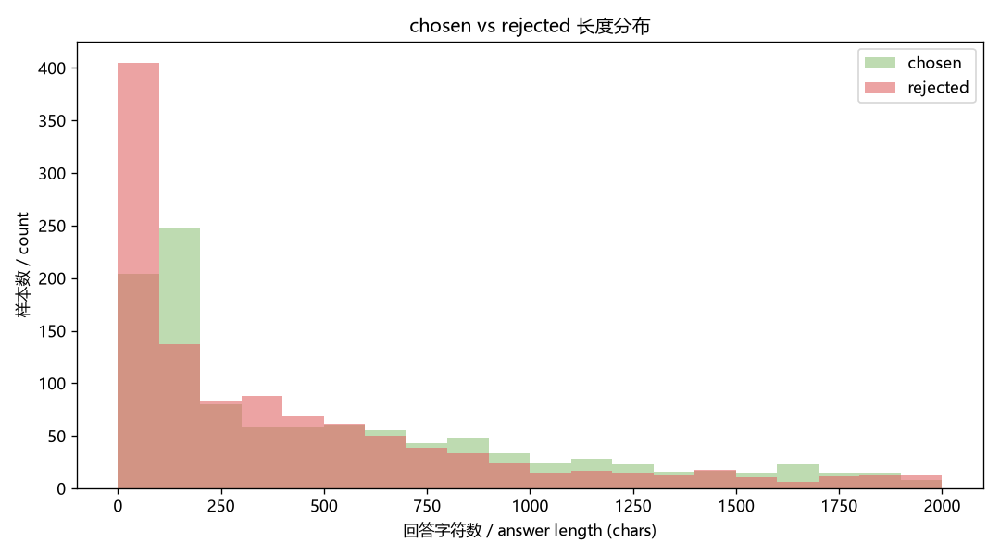

# Week4 Day18 交付：偏好数据集统计

> 由 `Week4/code/build_preference_data.py` 自动生成。
> 总量 **1221** 条（验收下限 300，✅ 达标）。
> 随机种子 42，可复现。

## 一、来源构成

| 来源 | 条数 | 语言 | 说明 |
|---|---|---|---|
| UltraFeedback | 500 | 英 | 通用有用性/正确性偏好 |
| DPO-En-Zh-20k (zh) | 500 | 中 | 语言平衡 |
| 自建 | 221 | 中 | 5 类偏好精准覆盖 |
| **合计** | **1221** | 中英均衡 | |

## 二、偏好类型分布

| 类型 | 条数 |
|---|---|
| 开源(英) | 500 |
| 开源(中) | 500 |
| 安全性 | 80 |
| 事实正确性 | 40 |
| 完整性 | 36 |
| 有用性 | 35 |
| 格式 | 30 |

## 三、安全类风险覆盖（自建）

| 风险子类 | 条数 |
|---|---|
| 反过度拒绝 | 20 |
| 仇恨歧视内容生成 | 6 |
| 伪造证件公章 | 6 |
| 自伤自杀方法 | 6 |
| 电信诈骗话术 | 6 |
| 爆炸物与危险化学品 | 6 |
| 毒品制造 | 6 |
| 网络入侵 | 6 |
| 武器制作 | 6 |
| 隐私窃取与人肉 | 6 |
| 恶意软件 | 6 |

## 四、质量指标

- chosen 平均长度：773 字符
- rejected 平均长度：595 字符
- 超 `cutoff_len` 告警条数：329（训练时会被截断，不影响可用性）
- 校验规则（非空 / chosen≠rejected / 长度合理性 / 自建 prompt 去重）：**全部通过**

> 长度分布见 `pref_length.png`：安全类 chosen 因四段式拒答说明偏长，其余类型chosen 与 rejected 长度接近，说明偏好信号来自质量而非单纯长度。

## 五、组成可视化

