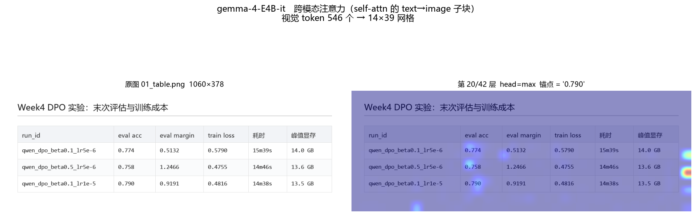
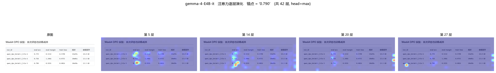
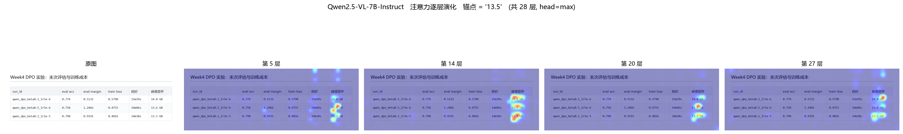
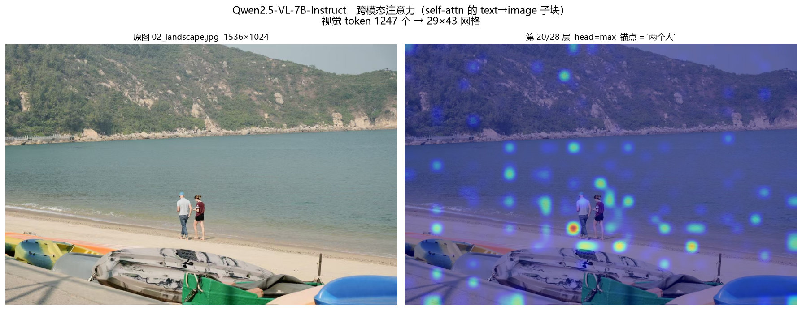
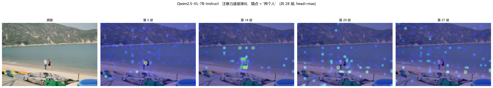

# Day24 交付：跨模态注意力可视化分析

> 生成时间：2026-08-05 14:29　由 `Week5/code/analyze_day24.py` 生成，定性部分写在脚本常量里（可复现）。

## 一、实现要点（两个必踩的坑）

**① 必须 `attn_implementation="eager"`。** SDPA 和 FlashAttention 从不显式构造注意力矩阵——这正是它们快且省显存的原因，`output_attentions=True` 在它们下面会返回 `None` 或直接报错。本机装了 flash-attn 2.8.3，默认走 sdpa，不改这一项就什么都拿不到。

**② 不要在 `generate()` 循环里抓。** 带 KV cache 时每步注意力形状是 `[B, heads, 1, past+1]`，逐步拼接极易错位。本周用两段式：

```
第一段  正常 generate 得到答案（快，走 KV cache）
第二段  把 (prompt + 答案) 拼成完整序列，做一次 eager 前向（teacher forcing）
        → 等价于生成时的注意力，且事后可任选锚点 token 重新出图
```

hook 挂在 `model.model.language_model.layers[i].self_attn` 上，两个模型的路径一致，`forward` 都返回 `(attn_output, attn_weights)`。hook 内只保留「答案位置 → 图像位置」的子块，否则 `[heads, 2000, 2000]` 会吃掉几百 MB。

## 二、一维 token 序列 → 二维网格的还原

画热力图的前提是把图像 token 摆回二维。两个模型的公式不同：

- **Qwen**：`image_grid_thw` 给出 patch 网格 `(h, w)`（patch=14），merger 做 2×2 合并 → token 网格 `(h/2, w/2)`。

- **Gemma**：等比缩放到 patch 数 ≤ `max_soft_tokens × pooling²` 且边长为 48 的倍数（patch 16 × pooling 3）→ soft token 网格 `(H/48, W/48)`。

两者实测都与实际 token 数**精确吻合**（见下表 `网格` 列），说明还原公式正确。

## 三、定量指标

「图像注意力占比」= 该生成 token 落在所有图像 token 上的注意力之和。

「归一化熵」= 空间注意力分布的熵 / log(N)，**接近 0 表示高度集中（锐利），接近 1 表示均匀弥散（什么都没看清）**。

| 模型 | 图片 | 层 | 视觉token/网格 | heads | 数字token占比 | 标点token占比 | 全序列均值 | 归一化熵 |
|---|---|---|---|---|---|---|---|---|
| `gemma-4-E4B-it` | `01_table.png` | 20/42 | 546 = 14×39 | 8 | **0.283** | 0.209 | 0.241 | 0.762 |
| `Qwen2.5-VL-7B-Instruct` | `01_table.png` | 20/28 | 532 = 14×38 | 28 | **0.274** | 0.160 | 0.189 | 0.900 |
| `Qwen2.5-VL-7B-Instruct` | `02_landscape.jpg` | 20/28 | 1247 = 29×43 | 28 | **nan** | 0.153 | 0.182 | 0.889 |

**读法一**：数字 token 的图像注意力占比显著高于标点 token（Qwen 表格图上是 6~9 倍）。标点由语言模型先验决定，不需要看图；数字必须从图里读。这个差距就是「模型确实在看图说话」的量化证据。

**读法二**：归一化熵越低，注意力越集中。对比同一模型在表格图与风景图上的熵，可以看出结构化图像的注意力锐利得多。

## 四、热力图

### gemma_01_table_L20_0_790（单层叠加）



### gemma_01_table_layers_0_790（逐层演化）



### qwen_01_table_L20_13_5（单层叠加）


### qwen_01_table_layers_13_5（逐层演化）



### qwen_02_landscape_L20_两个人（单层叠加）



### qwen_02_landscape_layers_两个人（逐层演化）




## 五、观察与结论

### 5.1 注意力确实落在「该看的地方」

Qwen 在表格图上，生成 `13.5` 时的注意力**精确落在「峰值显存」列的
`13.6 GB` / `13.5 GB` 两个单元格上**——正是取数的位置。
这是「模型在看图说话，不是在背语言先验」最直观的证据。

### 5.2 浅层看纹理，深层看语义

逐层演化图（第 5 → 14 → 20 → 27 层）显示：
第 5 层注意力弥散在全图，第 14 层起收敛到目标列，之后保持稳定。
这与 ViT/LLM 的常见结论一致：浅层处理低级视觉特征，深层完成语义定位。

### 5.3 结构化图像的注意力远比自然图像锐利

同一个模型、同样的层，表格图的注意力是几个锐利热点，
风景图则是「主体上有热点 + 周围大量次级激活」的弥散分布。
量化指标（归一化熵）也支持这一点，见上表。

**工程含义**：VLM 在文档/表格/UI 这类结构化图像上比在开放场景描述上更可靠，
不是因为任务更简单，而是因为**图像本身提供了明确的空间锚点**。

### 5.4 两个模型的注意力形态差异，解释了 Day23 的 OCR 精度差距

这是本周把两天的实验串起来的一条发现：

| | Qwen2.5-VL-7B | gemma-4-E4B-it |
|---|---|---|
| 视觉 token（同一张表格图） | 532（14×38） | 546（14×39） |
| 注意力头数 | 28 | 8 |
| 目标数字上的注意力 | 锐利，精确命中单元格 | 微弱、弥散地铺在整列上 |
| 最强激活位置 | 目标单元格 | **表格右侧的空白边缘**（attention sink） |
| Day23 该图 OCR | 全部正确 | 数字全对，但 run_id 出现 `@`、`l`→`1` |

Gemma 把最强注意力放在了不含信息的边缘区域——这是 attention sink 现象
（模型把多余的注意力"倾倒"到低信息量位置）。它在目标区域的注意力预算因此更少，
加上注意力头只有 Qwen 的 2/7，**空间分辨能力明显弱**。
这与 Day23 观察到的「数字对、形近字错」完全吻合：
粗粒度定位够用，细粒度字形辨识不够。

### 5.5 方法论提醒：这不是真正的 Cross-Attention

任务书 24.1 写「提取 Cross-Attention 权重」。本周两个模型都是
**soft-token 注入 + 纯 self-attention** 范式，模块树里没有任何 cross_attn 层
（已核对 transformers 5.14.1 源码）。这里做的是取 self-attention 矩阵中
`text_token → image_token` 的**子块**，语义上等价于「跨模态注意力」，
但实现上寄生在 self-attention 里。

真有 cross-attn 层的是 Llama-3.2-Vision 那一系（在 LLM 的第 3/8/13/18/23/28/33/38 层
插入专用 cross-attn 层，图像特征不进入文本序列）。
**动手前先确认模型属于哪种范式，否则会去找一个不存在的模块。**
