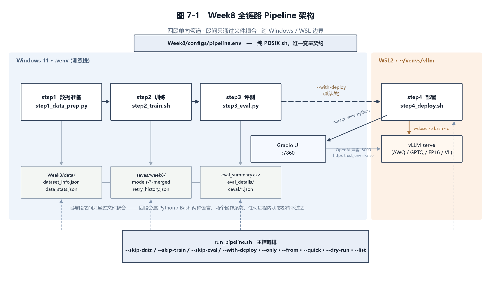

# Week8 — 全链路自动化与知识蒸馏

把前七周的手工步骤固化成一条可一键运行的四段 Pipeline，并做一次白盒知识蒸馏。

**本周产出的不是模型，是流程。** 除了蒸馏那两个 0.5B 学生模型之外没有训练新的 3B 模型
——这是刻意的：Day40~41 要求的是把已有步骤固化，而固化的价值恰恰在于它逼你把之前
糊过去的隐式决定显式化（见 §六）。

---

## 一、三十秒上手

```bash
# 仓库根目录
bash Week8/scripts/verify_all.sh      # ① 先自检，确认这套东西在你机器上能跑（约 1 分钟）
bash run_pipeline.sh --list           # ② 看看现在各段处于什么状态
bash run_pipeline.sh --skip-train     # ③ 跑数据 + 评估两段（不占卡几小时）
```

三条命令的定位不同：`verify_all.sh` 回答"环境对不对"，`--list` 回答"我在哪"，
`--skip-train` 回答"能不能真的跑出东西"。

完整参数与设计取舍见 **[`docs/Pipeline使用说明.md`](docs/Pipeline使用说明.md)**，
逐脚本用法见 **[`docs/脚本速查.md`](docs/脚本速查.md)**。

---

## 二、目录结构

```
Week8/
├── scripts/          14 个脚本，见 docs/脚本速查.md
├── configs/          pipeline.env（唯一变量契约）+ 7 个 YAML
├── data/             step1 的产物：train/val（Alpaca + ShareGPT）+ dpo_train/val
├── docs/             使用说明 + Day40/41/42 实现细节
├── reports/          ch1~ch8 分章 + 拼装后的技术报告(.md/.docx) + figs/
├── deliverables/     数据统计 / 评估汇总 / 蒸馏对比表 / CEval 明细 / 验收日志
└── logs/             流水线日志、重试历史、训练日志（多数 gitignored）
```

---

## 三、四段 Pipeline



| 段 | 脚本 | 输出 | 典型耗时 |
|---|---|---|---|
| **data** | `step1_data_prep.py` | `data/*.json`、`deliverables/data_stats.{json,md}` | 32 s |
| **train** | `step2_train.sh` | `saves/week8/`、`models/*-merged` | 数十分钟~数小时 |
| **eval** | `step3_eval.py` | `deliverables/eval_summary.{csv,md}`、`ceval/`、`eval_details/` | 8 min（20 题） |
| **deploy** | `step4_deploy.sh` | 常驻 vLLM(:8000) + Gradio(:7860) | 启动 1~2 min |

段与段之间**只通过文件耦合**。这不是洁癖：四段分属 Python / Bash 两种语言、
Windows / WSL 两个操作系统（vLLM 没有 Windows 轮子），任何进程内状态都传不过去。
换来的好处是任何一段都可以单独跑、单独调试、单独替换实现，只要文件契约不变。

`configs/pipeline.env` 是唯一的变量契约，刻意写成**纯 POSIX sh**（不用数组、
不用 `[[ ]]`、不用 `local`）——下游可能被 `bash` 也可能被 `sh`(dash) 加载，
可能在 `set -u` 严格模式下。

---

## 四、本周的四个关键判断（与任务书的偏差及理由）

### 1. 42.2 的「LLaMA-Factory 的蒸馏功能」在本地版本里不存在

本地 LF 0.9.6.dev0 @ 76a0391 源码核查，三条证据：

| # | 检查 | 结果 |
|---|---|---|
| a | `grep -rniI "teacher" LLaMA-Factory/src/ --include=*.py \| wc -l` | **0** |
| b | `finetuning_args.py:460` 的 stage 枚举 | `["pt","sft","rm","ppo","dpo","kto"]` —— 无 kd |
| c | 唯一的 KL 实现 `trainer_utils.py:743` | 只被 ASFT 调用，比的是 policy vs **同尺寸** reference model，防漂移而非跨尺寸蒸馏 |

任务书原文是「利用 LF 的蒸馏功能（**或自行实现**）」，故走后者：`scripts/distill_kd.py`。

> 这是第 **三** 次「任务书说框架支持、源码里其实没有」（第 4 周 DPO 超参、
> 第 7 周 `--quantization_method awq` 导不出 AWQ、本周蒸馏）。方法论：
> **任何「框架支持 X」的说法，在依赖它做决策之前先 grep 一遍源码。**

### 2. OpenCompass 这条路不通，但 CEval 这件事做成了

OpenCompass 从第 3 周起就没装成功过；本想退回 LF 自带评测器，实测**它也不行**
——上游已把 `evaluation/` 数据加载目录整个删掉：

```
$ git ls-files | grep '^evaluation'          # 空
$ cached_file('evaluation/ceval', 'mapping.json')
OSError: evaluation/ceval is not a local folder and is not a valid model identifier
```

但卡住的**不是评测方法，而是数据**——而数据一行就下来了：

```python
load_dataset('ceval/ceval-exam', name='computer_network')
```

于是写了 `scripts/ceval_local.py`（52 学科 1346 题，ppl-5shot），把挂了五周的
52 个 ⏳ 变成真实分数。基座 0.5B 测得 **53.71**，与 Qwen 官方报的 C-Eval（≈54）吻合。

> **诚实留空不等于放弃，它只是拒绝用假数字提前结账。**

### 3. 「跳过」必须是人的决定，不是脚本的自作聪明

看起来更聪明的设计是「产物已存在就自动跳过」。但四段代价差三个数量级，
自动跳过意味着**改了配置重跑时它会悄悄用旧产物**——症状是
「我明明把 lr 改了，为什么分数一模一样」，既难发现，发现后又会让人回头怀疑
之前所有实验结论。所以只提供**显式跳过**，并在开头把本次计划打出来让人核对。

### 4. 部署段默认不跑

`step4` 起的是常驻服务，会一直占着显存和端口。一条「跑完就退出」的流水线突然
变成「跑完还挂着两个后台进程」，对无人值守调用是灾难。必须 `--with-deploy` 显式打开。

---

## 五、蒸馏实验：四组对照

任务书字面只需两组（蒸馏前 / 蒸馏后），但 A→C 的差值里混着两样东西：
① 在这批数据上又训了 2 轮（**纯 SFT 也能拿到**）② 教师软标签带来的额外信息。
只报 A→C 就是把 ① 的功劳记在蒸馏头上。所以加了 B 组（α=0，其余全同）：

> **C − B 才是蒸馏的净效果。**

| 组 | 模型 | CEval | 自动 5 维 | tok/s (b=1) |
|---|---|---|---|---|
| A 学生基座 | `Qwen2.5-0.5B-Instruct` | 53.71 | 3.697 | 55.8 |
| B 纯 SFT (α=0) | `Qwen2.5-0.5B-week8-sft` | 53.19 | 3.444 | 48.1 |
| C KD (α=0.5, T=2) | `Qwen2.5-0.5B-week8-distill` | 52.90 | 3.436 | 53.7 |
| **D 教师 3B** | `Qwen2.5-3B-week4-dpo-merged` | **73.77** | **4.204** | 39.3 |

**先确定分辨率再解读差异**：n=1346、p≈53% ⇒ `SE = √(2p̄(1−p̄)/n) = 1.92 pp`，
95% 置信下可分辨的最小差异 **3.77 pp**。

| 比较 | 差值 | z | 结论 |
|---|---|---|---|
| C − B（蒸馏净效果） | −0.29 pp | −0.15 | 不显著 |
| **D − A（师生差距）** | **+20.06 pp** | **+10.82** | **高度显著** |

结论是确定的：**三个学生组统计上无法区分，师生之间的 20 个百分点是决定性的。**
这不是「说不清」，而是「2 个 epoch 在这个规模下产生的变化小于实验分辨率」——
**分辨率本身就是一项结果**，它直接给出后续实验的设计要求。

**蒸馏链路确实跑通了**，三条独立证据：词表对齐已核实（`get_vocab()` 全等，
vocab_size 151936）、KD 项 2.1802 → 1.2187（**−44%**）、B/C 的 CE 按预期方向与量级
分化（1.2925 vs 1.4044，说明 α 在生效）。42.2 界定的「验证可行性」达成。

**一个对部署更有价值的发现**：参数量差 6 倍，batch=1 端到端只差 **1.37 倍**。
0.5B 在 batch=1 下已不是带宽瓶颈，时间花在与模型大小无关的固定开销上。
与第 7 周并发数据互证（AWQ b=1 226.5 → 并发 16 2018.9 tok/s，摊薄 8.9 倍）：

> **小模型的速度优势要在批量/并发下才兑现，不在单条对话下。**

详见 [`docs/Day42_知识蒸馏.md`](docs/Day42_知识蒸馏.md)。

---

## 六、自动化逼出来的三个「本该早就想清楚」的问题

1. **验证集到底是谁切的** —— `val_size` 与显式 `eval_dataset` 同时存在会形成二次划分，
   实际训练样本变成 4216 × 0.9 = 3794，eval loss 算在多切出来的 422 条上。
   **它不报错、不警告、训练照跑、曲线照出，只是数字悄悄换了含义。**
2. **OOM 降配时等效 batch 变了没有** —— 只减 batch 不补 accumulation，
   等效 batch 从 16 掉到 8，训出来的就是另一个实验，而流水线还会把它当最优模型交付。
3. **跑不起来的评测该记什么** —— 答案是多级回退 + 如实记录，而不是填一个看起来
   合理的数字。缺失值写 `⏳` 而非 `0`（`0` 会被下游当成"考了 0 分"参与平均）。

> **这三个问题的答案，比 Pipeline 本身更有价值。**

---

## 七、实跑证据

### 验收 ❶：Pipeline 可无报错运行

2026-08-25 `bash run_pipeline.sh --skip-train`，日志见 `deliverables/logs/`：

| 段 | 结果 | 耗时 |
|---|---|---|
| data | ✓ | 32 s |
| eval（基座，20 题贪心生成） | ✓ | 505 s |

### 工具链自检：82/82 全绿

```bash
bash Week8/scripts/verify_all.sh --full
# 通过 82   失败 0   跳过 0
```

覆盖环境版本锁、脚本语法、YAML 可解析、**B/C 对照组有效性**（配置只差 `kd_alpha`）、
主控全部参数组合的 dry-run、**三条反向用例**（非法参数必须失败）、
打分器对齐质量不退化（rho ≥ 0.85）、报告字数与图片完整性、交付物齐备、
仓库无权重文件入库，以及三项 GPU 冒烟。

### 跨两周、跨脚本，20/20 题答案逐字节相同

这次生成的 20 条基座答案与第 3 周用另一个脚本生成的**逐题完全一致**：

```bash
.venv/Scripts/python.exe -c "
import json
a=json.load(open('Week3/deliverables/eval_answers/answers_qwen_base.json',encoding='utf-8'))['records']
b=json.load(open('Week8/deliverables/eval_answers/base.json',encoding='utf-8'))['records']
print(sum(1 for x,y in zip(a,b) if x['answer']==y['answer']), '/', len(a))"
# → 20 / 20
```

两次相隔约两周、两个独立编写的脚本、中间还换过机器。能对上是因为贪心解码 +
同一份题目与顺序 + 同一个 `max_new_tokens=512`，而依赖版本被 `requirements.txt`
钉死到 `+cu124` 级别。

---

## 八、已知缺口

| 项 | 状态 | 说明 |
|---|---|---|
| CMMLU | 未做 | CEval 的题目结构（52 学科 / dev 恰好 5 条 few-shot / val 带答案）是 `ceval_local.py` 的实现前提，CMMLU 组织方式不同，套用会得到口径不明的数。CSV 里留 `⏳` |
| 技术报告 PDF | 未产出 | 本机无 Word 也无 LibreOffice。`.docx` 是完整终稿（13 图齐全），换机另存即可 |
| 目录重组（45.2） | 有意偏差 | 新代码按功能组织；`WeekN/` 保持不动——移动会让几十个用 `parents[2]` 定位的脚本同时失效，且七份周报里的路径引用全部变死链。已在根 README 用 ★ 说明 |

---

## 九、相关文档

- [`docs/Pipeline使用说明.md`](docs/Pipeline使用说明.md) —— 主控参数、四段行为、设计取舍、常见问题
- [`docs/脚本速查.md`](docs/脚本速查.md) —— 14 个脚本逐个的用途 / 参数 / 输入输出
- [`docs/Day40_数据与训练自动化.md`](docs/Day40_数据与训练自动化.md) —— 清洗漏斗、去重算法、OOM 五档阶梯、注入式测试
- [`docs/Day41_评估与部署自动化.md`](docs/Day41_评估与部署自动化.md) —— 四级回退、打分器建模、跨 WSL 部署
- [`docs/Day42_知识蒸馏.md`](docs/Day42_知识蒸馏.md) —— 软标签/温度原理、T² 推导、四组对照与显著性
- [`deliverables/第8周_全链路自动化与蒸馏报告.md`](deliverables/第8周_全链路自动化与蒸馏报告.md) —— 本周周报
- [`reports/技术报告_Qwen2.5-3B全链路实践.md`](reports/技术报告_Qwen2.5-3B全链路实践.md) —— 八章技术报告（31,666 中文字符）
- [`../README.md`](../README.md) —— 仓库总览、环境安装、十条常见问题
