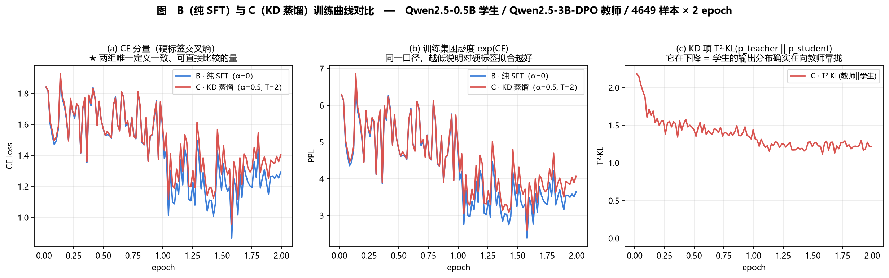

# Day42 — 知识蒸馏探索

> 任务书 42.1 / 42.2 / 42.3
> 交付：蒸馏配置文件、训练日志、蒸馏效果对比表
> 教师 `Qwen2.5-3B-week4-dpo-merged`（第 4 周 DPO 模型）→ 学生 `Qwen2.5-0.5B-Instruct`

---

## 一、42.1 原理：软标签与温度系数

### 1.1 软标签为什么比硬标签信息量大

硬标签是 one-hot：第 t 步的答案是 token `"3"`，其余 151935 个词概率为 0。
教师的软标签是一整个分布：也许 `P("3")=0.6, P("三")=0.2, P("4")=0.05 …`

后面这些非零项就是 Hinton 所说的 **dark knowledge**——它编码了**类别之间的相似结构**
（`"3"` 和 `"三"` 语义相近、和 `"4"` 是近邻数字、和 `"猫"` 毫无关系）。one-hot 把这些
全抹平了。每个 token 位置从「1 bit 的监督」变成「151936 维分布的监督」，
这就是 KD 在小数据量下往往比纯 SFT 更省样本的原因。

### 1.2 温度系数 T 在做什么

`softmax(z/T)`：T>1 把 logits 压扁，放大小概率项的相对权重，让 dark knowledge 真正
参与到损失里。

- T → 0：退化成 one-hot，等于没蒸馏
- T → ∞：退化成均匀分布，全是噪声

本任务取 **T = 2.0**：Qwen 的输出分布本身相当尖锐（top-1 概率常 > 0.9），
T=1 时 KL 几乎只被 top-1 支配，等价于软化版的 CE；T=2 能把 top-5~top-50 的结构带进来，
又不至于把长尾噪声放大到主导损失。

### 1.3 ★ 为什么 KL 项要乘 T² —— 本任务里最容易写错的一行

对 `z_s` 求导：

```
∂/∂z_s [ KL(softmax(z_t/T) ‖ softmax(z_s/T)) ] = (1/T) · (p_s^(T) − p_t^(T))
```

也就是**梯度幅度按 1/T 缩**；而在小 logits 极限下展开 softmax，
`(p_s − p_t)` 本身又正比于 `(z_s − z_t)/T`，两处合起来是 **1/T²**。

若不乘回 T²，把 T 从 1 调到 4 会让 KD 梯度悄悄缩小约 **16 倍**——于是「α 的含义」
随 T 漂移，α=0.5 在 T=1 和 T=4 下根本不是同一个权重，超参完全不可比。
乘上 T² 之后 KD 项的梯度尺度与 CE 项同阶，α 才真的是「两个损失的相对权重」这个语义。

最终的损失：

```
L = α · T² · KL(p_teacher^(T) ‖ p_student^(T)) + (1 − α) · CE(z_s, y)
```

### 1.4 ★ 为什么必须只在 assistant 回复 token 上算损失

训练样本的完整序列是 `[system][user 指令][assistant 回复]`。prompt 部分是**输入**，
不是要学的目标。若不 mask：

1. **CE 项**会让学生去「预测用户下一句会说什么」——学的是复述用户输入，
   生成时表现为鹦鹉学舌、重复提问。
2. **KD 项**更微妙但同样有害：prompt 段占 token 总数的一大半（本次实测
   **43.5%** 是 prompt，只有 56.5% 是 assistant 回复），教师在这段上的分布是
   「如何续写用户的话」，与「如何回答」是两回事。不 mask 等于让**将近一半**的
   蒸馏信号去对齐一个我们根本不关心的任务，真正有用的回复段被稀释。

实现上：labels 里 prompt 位置填 `IGNORE_INDEX = -100`；KL 也用同一个 mask，
两个损失项作用在**完全相同的 token 集合**上，α 才是干净的加权。

---

## 二、42.2 实现：为什么自行实现而不是用 LLaMA-Factory

### 2.1 ★ LF 0.9.6.dev0 没有蒸馏功能——三条源码证据

任务书写的是「利用 LLaMA-Factory 的蒸馏功能（**或自行实现**）」。
本地 LF（0.9.6.dev0 @ 76a0391）源码核查结论：**没有蒸馏功能**。

| # | 检查 | 命令 | 结果 |
|---|---|---|---|
| a | 有没有 teacher 这个概念 | `grep -rniI "teacher" LLaMA-Factory/src/ --include=*.py \| wc -l` | **0** |
| b | stage 枚举里有没有 kd | `finetuning_args.py:460` | `Literal["pt","sft","rm","ppo","dpo","kto"]` —— **无 kd / distill** |
| c | 唯一的 KL 实现用在哪 | `trainer_utils.py:743 _kl_divergence` | 只被 `_asft_cross_entropy` 调用；ASFT 是 DPO 家族的对齐损失，比的是 policy vs **同尺寸 reference model**，用途是防漂移，**不是跨尺寸蒸馏** |

三条证据的形态值得注意：不是「我试了一下不行」，而是**符号不存在 / 枚举里没有 /
唯一的实现被用在别处**——这三种都是可复现、可反驳的证据。

> 这与第 7 周「LF 的 `--quantization_method awq` 其实导不出 AWQ」是同一类情况：
> 任务书对 LF 能力的描述再次与源码不符。得到的方法论是：
> **任何「框架支持 X」的说法，在依赖它做决策之前先 grep 一遍源码。**

### 2.2 ★ 白盒 logit KD 的前提：词表必须完全一致

黑盒方案（教师生成回答 → 学生 SFT）不需要词表一致，但每个 token 只拿回 1 bit 监督，
且完全用不到「软标签 / 温度系数」这两个 42.1 明确要求的概念。

本机核实（可复现）：

```python
a = AutoTokenizer.from_pretrained('models/Qwen2.5-0.5B-Instruct')
b = AutoTokenizer.from_pretrained('models/Qwen2.5-3B-week4-dpo-merged')
a.get_vocab() == b.get_vocab()          # True，均 151665 项
a.encode(s) == b.encode(s)              # True
a.apply_chat_template(m) == b.apply_...  # True
config.json 的 vocab_size               # 均 151936
```

词表对齐 ⇒ 两个模型在同一个 token 位置输出的 logits 落在**同一个 151936 维坐标系**里，
可以直接逐位置算 KL。**这是能做真蒸馏的前提，也是本任务最关键的判断。**

### 2.3 六条工程取舍

| # | 取舍 | 理由 |
|---|---|---|
| 1 | 自行实现，不用 LF | 见 §2.1，LF 里根本没有 |
| 2 | 白盒 logit KD，不用黑盒序列蒸馏 | 词表一致（§2.2），且黑盒用不到软标签/温度 |
| 3 | **学生全参训练，不用 LoRA** | KD 的本质是重塑学生的**整个输出分布**；0.5B 只有 494M 参数，再套 rank-32 LoRA（约 8M 可训，1.6%）等于让蒸馏信号只能穿过一个极窄的瓶颈。前几周用 LoRA 是为 3B 省显存，0.5B 全参在 24GB 上跑得动 |
| 4 | **在线教师前向，不做离线 top-K 预计算** | 离线能省教师那 6.2GB，但代价是磁盘（4684 × 768 × top-64 ≈ 2.2GB，C 盘只剩 35GB），且 top-K 截断会丢掉长尾的 dark knowledge（截断后还要重归一化，KL 的语义就变了） |
| 5 | **forward KL**（mode-covering），不是 reverse KL | `KL(p_teacher ‖ p_student)`：教师概率高的地方学生必须也给概率。经典 KD（Hinton）用 forward，本任务遵循经典形式以对齐 42.1 的描述 |
| 6 | **KL 只在有效位置上算**（先 gather 再 softmax） | logits 是 `[B, L, 151936]`，B=2/L=768 时单个就有 467MB(bf16)，fp32 log_softmax 中间量再翻倍。先按 `labels != -100` gather 出有效位置（约 56.5%），省掉近一半 softmax 中间显存，同时天然实现了「只在 assistant 回复上蒸馏」 |

### 2.4 两个数值细节

**① KL 必须在 fp32 里算。** 151936 维的 `log_softmax` 在 bf16 下（尾数只有 8 bit）
累加误差足以让 KL 出现负值甚至 NaN。代码里显式 `.float()`。

**② 学生权重 fp32 + bf16 autocast，而不是直接 bf16 加载。** 后者会让优化器状态也是
bf16，0.5B 全参在 lr=1e-5 量级下，bf16 的 8-bit 尾数会把大部分小更新直接吃掉
（更新量小于权重的 2⁻⁸ 相对精度时加不进去）。

### 2.5 ★ 一份代码两组实验：alpha=0 就是对照组

同一个 `distill_kd.py` 同时承担 B/C 两组，靠 YAML 里的 `kd_alpha` 切换：

- `alpha = 0` → **纯 SFT 对照组（B）**，教师根本不加载
- `alpha > 0` → **KD 蒸馏组（C）**

这是刻意的：保证 B/C 之间**除了 KD 损失项以外没有任何差异**（同数据、同超参、
同随机种子、同 collator、同学习率调度）。如果 B/C 用两个脚本，
「收益到底来自蒸馏还是来自实现差异」就永远说不清。

`student_sft_baseline.yaml` 与 `distill_kd.yaml` 逐行可 diff，只差三处：
`run_name` / `output_dir` / `kd_alpha`。

---

## 三、训练记录

### 3.1 两组的实跑数据

**表 D42-1　B / C 两组训练概况**

| 项 | B · 纯 SFT（α=0） | C · KD 蒸馏（α=0.5, T=2） |
|---|---|---|
| 样本 | 4649 条（原始 4684，截断 124） | 同左 |
| token 总量 | 1,128,163 | 同左 |
| 参与损失的 assistant token | 637,245（**56.5%**） | 同左 |
| 优化步数 | 582（2 epoch，等效 batch 16） | 582 |
| 训练耗时 | 23.63 min | **21.62 min** |
| 峰值显存（整卡） | 21,532 MiB | 24,117 MiB |
| CE 首→末 | 1.8402 → **1.2925** | 1.8408 → **1.4044** |
| 训练集 PPL 首→末 | 6.298 → **3.642** | 6.301 → **4.073** |
| KD 项首→末 | —（恒为 0） | 2.1802 → **1.2187** |

> ★ **耗时那一行不能拿来比较。** B 组是在游戏（Cities: Skylines II，占约 10GB 显存）
> 运行期间跑的，C 组是关掉游戏之后跑的。同一张卡上两次测量的外部条件不同，
> 「C 比 B 快 2 分钟」这个差值没有意义——**恰恰相反**，C 多做了一次 3B 教师的
> 前向，理应更慢。放在表里是为了留下记录，不是为了下结论。

### 3.2 ★ 一次被 GPU 争用暴露的性能悬崖

C 组第一次启动时（游戏仍在运行），速度是 **38.5 s/it**；关掉游戏重跑，
稳定在 **2.2 s/it**——**17 倍**。

原因很明确：

```
显存: 23915 MiB / 24564 MiB      ← 满了
Cities2.exe 占约 10GB
```

B 组峰值 21.5GB 刚好塞得下，C 组要多加一个 6.2GB 的教师 → 溢出 →
**Windows 的 sysmem fallback**：驱动不报 OOM，改用系统内存兜底，于是训练**静默降速**。

这正是第 2 周记录过的那个坑的复现。它的危险之处在于**它不报错**——
如果没有 B 组 2.4 s/it 作为对照，38.5 s/it 很容易被当成「KD 本来就慢」而接受，
然后得出一个「蒸馏代价太高、不实用」的错误结论。

> **教训：跨实验比较性能之前，先确认两次测量的外部条件相同。**
> 这和第 7 周「用 nvidia-smi 量不出量化省了多少显存」是同一类错误的两个面：
> 一个是口径不对，一个是条件不同。

### 3.3 ★ 日志里的 `loss` 列不是每 token 均值

实测 `loss / ce_loss` 恒等于 **8**（= `gradient_accumulation_steps`；
B 组 96 条日志的比值区间是 7.40 ~ 8.00，末尾不足一个完整累积窗口时略小）。

也就是说 Trainer 记的 `loss` 是**累积窗口内的求和**，不能当成「平均每 token 损失」读。
要看模型学得怎么样，只能看 `ce_loss` / `ppl_train`——`distill_kd.py` 的 `log()`
把这两个分量单独记下来正是为此。

另一个连带的观察：`grad_norm` 全程在 **33 ~ 188** 之间，而 `max_grad_norm = 1.0`——
**梯度裁剪全程饱和**。这意味着优化器实际执行的接近「归一化梯度下降」，
更新方向由梯度决定、步长由 `lr × 1.0` 决定。这一点对 B/C 是**同等施加**的，
不影响对照的有效性。

### 3.4 训练曲线



**图 D42-1　B（纯 SFT）与 C（KD 蒸馏）训练曲线对比**

> ★ **为什么不把两组的 `loss` 画在一张图上。** 两组的 `loss` 口径根本不同：
> B 的 `loss = CE`，C 的 `loss = 0.5·T²·KL + 0.5·CE`。直接叠在一起，
> 看到的差异**大部分来自损失函数定义不同**，而不是模型学得好不好。
> 唯一可比的量是 **CE 分量**（及其 exp，即训练集困惑度）——两组的 CE 都是
> 「在同一批 assistant token 上、对同一套硬标签」算出来的，定义完全一致。

三张子图各自说明一件事：

- **(a) CE 分量**：C 组的 CE 明显高于 B 组（末值 1.4044 vs 1.2925）。
  这是**预期之中**的：α=0.5 意味着只有一半的损失权重放在硬标签上，
  C 组对训练集硬标签的拟合必然不如把全部权重都放在 CE 上的 B 组。
  **CE 更高本身不是坏消息**——真正要问的是这半份权重换来的东西值不值。
- **(b) 训练集 PPL**：同一结论的另一种表达（3.642 vs 4.073）。
- **(c) KD 项**：从 2.1802 降到 1.2187，**降幅 44%**。这是「蒸馏确实在工作」的
  直接证据——学生的输出分布真的在向教师靠拢，而不是 KD 项挂在那里不动。

---

## 四、42.3 效果对比与分析

见 `Week8/deliverables/蒸馏效果对比表.md`（由 `compare_distill.py` 自动生成，
所有数字均为实测）。分析见下。

### 4.1 ★ 为什么是四组而不是两组

任务书写的是「对比蒸馏前后学生模型」，字面上只需要两组（A 蒸馏前 / C 蒸馏后）。
但 **A→C 的差值里混着两样东西**：

1. 在这批数据上又训了 2 轮 —— **纯 SFT 也能拿到的收益**
2. 教师软标签带来的额外信息 —— **真正属于蒸馏的收益**

只报 A→C，就是把 ① 的功劳记在蒸馏头上。所以必须加 B 组（α=0，其余全同）：

> **C − B 才是蒸馏的净效果。**

再加上教师本身作为天花板参照（D），四组一起看才能回答
「蒸馏把学生推到了教师的百分之几」这个真问题。

**表 D42-2　四个对照组**

| 组 | 模型 | 说明 |
|---|---|---|
| A | `Qwen2.5-0.5B-Instruct` | 学生基座，未做任何训练 |
| B | `Qwen2.5-0.5B-week8-sft` | α=0，同数据同超参同种子，教师不参与 |
| C | `Qwen2.5-0.5B-week8-distill` | α=0.5，T=2.0，教师在线前向 |
| D | `Qwen2.5-3B-week4-dpo-merged` | 第 4 周 DPO 模型，教师本身，天花板参照 |

### 4.2 三个指标各自回答什么

| 指标 | 回答的问题 | 口径 |
|---|---|---|
| **CEval** | 知识与推理的保真度 | ppl-5shot，52 学科 1346 题，官方 val 划分 |
| **20 题自动 5 维分** | 生成质量（CEval 是选择题，测不出「写得好不好」） | 规则法代理指标，模型级 rho=0.90 |
| **推理速度 tok/s** | 蒸馏的**动机本身** | batch=1 贪心，含 prefill，端到端 |

三个缺一不可：**只看 CEval 会漏掉「更快」，只看速度会漏掉「更笨」。**

> ★ **CEval 口径必须跟着分数走。** 本项目用 ppl 口径（比较 A/B/C/D 四个选项 token
> 的 logit，每题一次前向），**不是** OpenCompass 的 `ceval_gen` 口径（自由生成后正则
> 抽取）。ppl 口径对小模型更宽容（不惩罚「不会按格式作答」），分数系统性偏高，
> **不能直接与论文里标 `ceval_gen` 的数字比较**。四组内部横向可比。

