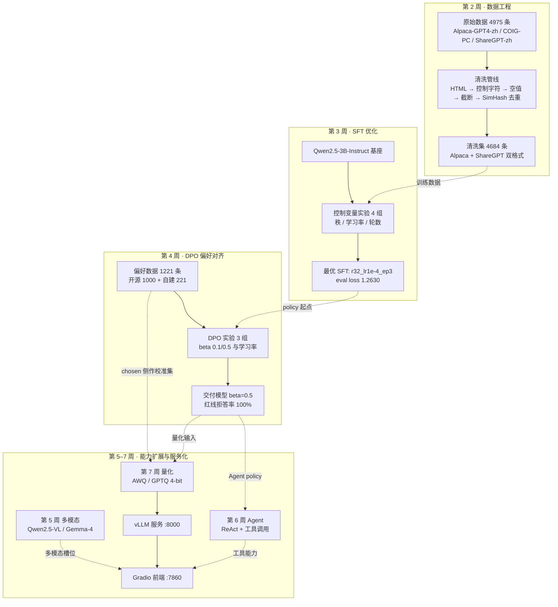

## 第 1 章 环境与架构

本章交代整个项目赖以运行的物理与软件底座。这套底座在八周里被动过三次——从 MacBook 到
RTX 4090、换机重建、再到引入 WSL2——每一次变更都不是"换个机器"那么简单，而是把某一类
技术方案从"可选"变成"不可能"或反过来。把这些变更讲清楚，后面几章里很多看似古怪的取舍
（为什么第 1 周不做 QLoRA、为什么 Windows 上 `dataloader_num_workers` 必须是 0、
为什么第 7 周才能上 vLLM）才有落点。

### 1.1 硬件与系统的三次演进

#### 1.1.1 三套环境的能力边界

**表 1-1　三套运行环境的能力差异**

| 能力项 | 环境① MacBook M4 Pro（第 1 周） | 环境② RTX 4090 / Windows（第 2–6 周） | 环境③ 4090 + WSL2（第 7 周起） |
|---|---|---|---|
| 芯片 / 加速器 | Apple Silicon M4 Pro，arm64 | RTX 4090，Ada 架构 | 同左，经 WSL2 GPU 直通 |
| 显存 | 16GB **统一内存**（CPU/GPU 共享） | 24GB 独立显存 | 24GB 独立显存 |
| GPU 后端 | MPS（Apple Metal） | CUDA 12.4 | CUDA 12.4 |
| `torch.cuda.is_available()` | 恒为 `False` | `True` | `True` |
| bitsandbytes / QLoRA | ❌ 4-bit 是 CUDA 专属 | ✅ | ✅ |
| bf16 训练 | ❌ | ✅ Ada 原生支持 | ✅ |
| vLLM | ❌ PagedAttention 绑定 CUDA | ❌ 官方不发 Windows wheel | ✅ Linux wheel |
| GPU 调度模型 | Metal 统一内存 | **WDDM**（与桌面程序共享时间片） | WDDM 之上的直通 |
| 本项目实际承担的工作 | 推理管线、架构剖析、分词实验、MPS LoRA | 全部 SFT / DPO / VLM / Agent 训练 | 量化、vLLM 服务化、前端 |

#### 1.1.2 每次变更逼出的架构调整

**第 1 周（Mac）的约束是"没有 CUDA"，逼出的是任务重排。** M4 Pro 的 16GB 是统一内存，
macOS 自身要占一部分，MPS 可用上限达不到 7B fp16 权重所需的约 14GB；更关键的是 QLoRA 依赖
`bitsandbytes`，而它的 4-bit 内核只有 CUDA 实现。于是第 1 周把"下载 → 推理 → 架构分析 →
分词实验"这条不需要 CUDA 的链路全部前置到 Mac 上跑通，用 `Qwen2.5-1.5B-Instruct` 做载体；
把 7B QLoRA、AWQ 压缩、vLLM 明确挂起到 4090。这不是"环境没配好"，是硬件边界决定的排程。
即便如此，第 1 周仍在 MPS 上把普通 LoRA 训练跑通了两次（`alpaca_zh_demo` 100 条 / 3 分 48 秒，
`identity_penguin` 91 条 / 1 分 39 秒），证明 LLaMA-Factory 的训练主干本身并不依赖 CUDA，
依赖 CUDA 的是量化与加速内核这一层。

*图 1-1　第 1 周在 MacBook M4 Pro（MPS）上完成的首次 LoRA 训练 loss 曲线*

**第 2 周换到 4090，约束变成了"Windows"。** CUDA 有了、bf16 有了、显存从共享 16GB 变成
独占 24GB，但换来两个全新的坑。其一，Windows 用 `spawn` 启动 DataLoader worker，跨进程共享
CUDA 张量走 IPC handle 会失败，并被 PyTorch 误报成 `CUDA error: out of memory`——现象是
step 0 就 OOM 而 `nvidia-smi` 显示显存几乎全空。因此全项目所有训练配置一律写死
`dataloader_num_workers: 0`。其二，Windows 的 GPU 走 WDDM 调度，桌面程序会与训练进程抢
时间片，第 3 周为此吃过一次训练慢 65% 的亏（详见 §3.5）。这两条都不是超参问题，
而是操作系统层面的行为，只能靠约定规避。

**第 6 周换了一次工作机器，代价是全部模型权重丢失。** `models/` 与 `saves/` 都在
`.gitignore` 里，进 git 的只有代码、配置和数据。这次事故反过来验证了一件事：因为训练数据
（`Week2/data/clean/`、`Week4/data/dpo/`）和每一份实验配置都进了版本控制，重建链路只需
"下载基座 → 重跑第 3 周最优配置 → 合并 → 重跑第 4 周最优 DPO"四步、约 40 分钟，
**不必重跑任何一组消融实验**——那些实验的结论已经以文档形式固化下来了。可复现性在这里
不是口号，是省下几十小时的实际收益。

**第 7 周新增 WSL2，动机单一且明确：vLLM 只发 Linux wheel。** 本机原先没装 WSL，
第 7 周装上 WSL 2.7.11（内核 6.18.33.2-2，WSLg 与 D3D 直通组件就位），形成 Windows 与
WSL2 并存的分工——WSL2 侧跑量化与 vLLM 服务（`~/venvs/{vllm,quant,lf}`），Windows 侧跑
Gradio 前端；模型仍留在 Windows 的 `models/` 下，WSL 通过 `/mnt/c/...` 访问。这样不占 WSL
虚拟盘，路径与前六周完全一致，代价是首次加载因 drvfs I/O 慢几分钟，属一次性成本。

### 1.2 软件栈与版本锁定

#### 1.2.1 锁定的版本组合

**表 1-2　主训练环境 `.venv` 的关键版本（依据 `Week2/requirements-lock.txt`）**

| 组件 | 版本 | 锁定理由 |
|---|---|---|
| Python | 3.12 | LLaMA-Factory 要求 ≥3.11；第 1 周为此已在 Mac 上单开过 py3.11 环境 |
| torch / torchvision / torchaudio | 2.6.0+cu124 / 0.21.0+cu124 / 2.6.0+cu124 | 三者必须同 CUDA 版本，否则 `_torchaudio.pyd` 加载报 `WinError 127` |
| transformers | 4.56.2 | 5.7.0 在 Win/py3.12 上导入 `Trainer` 直接段错误（exit 139，日志 0 行） |
| pyarrow | 18.1.0 | 24.0.0 的原生 DLL 与 torch 2.6 冲突，且只在 torch 先加载时触发 |
| datasets / accelerate / peft / trl | 4.0.0 / 1.11.0 / 0.18.1 / 0.24.0 | 全部卡在 LLaMA-Factory 允许范围的**上界**（见 §1.2.3） |
| tokenizers | 0.22.2 | 随 transformers 4.56.2 配套 |
| LLaMA-Factory | 0.9.6.dev0 @ `76a0391` | 以 commit 而非 tag 锁定，保证跨机器一致 |

#### 1.2.2 为什么必须 lock

第 2 周在全新的 4090 机器上从零装环境，踩到的两颗地雷都属于"最新版反而不能用"：
`transformers 5.7.0` 与 `pyarrow 24.0.0` 都是 pip 按依赖声明的上界自动选出来的最高版本，
都在导入期以**原生段错误**崩溃——没有 Python traceback，日志零行，只能用
`faulthandler.enable()` 拿到 C 层崩溃栈再逐库二分。其中 pyarrow 那条尤其隐蔽：单独
`import pyarrow` 不崩，必须 `import torch` 在前才触发，也就是说崩溃与**导入顺序**有关。
这类问题的定位成本远高于修复成本（修复只是一条 `pip install`），而且完全无法靠读代码预防。

锁文件的价值就在这里：把一次痛苦的二分定位结果固化成一行文本，让后来者——包括第 6 周
换机后的自己——不必重走一遍。事实上第 6 周在新机器上重装时，7 个关键包的版本与锁文件
逐条一致，这条链路是被真实验证过的，不是纸面约定。

#### 1.2.3 为什么 LLaMA-Factory 必须 `--no-deps` 装

这是本项目最反直觉的一条安装约定。LLaMA-Factory 0.9.6 对 `datasets`、`accelerate`、
`peft`、`trl` 声明的都是**区间依赖**，而锁文件里选定的版本恰好全部落在这些区间的上界。
问题在于 pip 的解析行为：直接 `pip install -e ./LLaMA-Factory` 时，pip 不会因为"已装版本
正好满足区间"就放过，它会按自己的解析结果重新拉一遍依赖，实际结果是把这四个包**降级**。
降级 `trl` 尤其致命——`trl` 1.x 删掉了 `AutoModelForCausalLMWithValueHead`，而
LLaMA-Factory 的 `model/loader.py` 在模块加载时就 import 它，一降级整个包直接 ImportError。

固化下来的解法是五步：① `pip install -e ./LLaMA-Factory --no-deps`；② 手工补齐 `omegaconf`、
`fire`、`tyro` 等缺失依赖，**跳过**上述四个包；③ `trl` 显式钉 0.24.0（同样 `--no-deps`）；
④ `torchaudio` 钉 2.6.0 匹配 torch；⑤ 运行时设 `DISABLE_VERSION_CHECK=1`，绕过 LF 的
`check_dependencies()` 对 transformers 版本上限的硬断言。这套流程在第 5 周被写进
`setup_venv_vlm.ps1`，第 6、7 周原样复用。

### 1.3 多虚拟环境隔离策略

项目最终维护了 6 个相互独立的 Python 环境。这不是洁癖——每一个都是被一次具体的依赖冲突
逼出来的：

**表 1-3　六个虚拟环境及其成因**

| 环境 | 归属 | 逼出它的那次冲突 |
|---|---|---|
| `.venv` | 第 2–4、6 周训练主环境 | 基准环境，`transformers 4.56.2` 是第 1–4 周可复现性的地基，不能动 |
| `.venv-oc` | 第 3 周 OpenCompass | OpenCompass 对 `transformers`/`datasets` 有自己的版本约束，装进 `.venv` 会破坏正在进行的实验 |
| `.venv-vlm` | 第 5 周多模态 | **Gemma 4 需要 `transformers >= 5.5.0`**，而主环境是 4.56.2；升级主环境等于打断前四周所有脚本的可复现性 |
| `.venv-agent` | 第 6 周 Agent | LangChain 会牵动 `transformers` / `tokenizers` / `pydantic` 三个包的版本 |
| WSL `~/venvs/vllm` | 第 7 周服务 | **vLLM 把 torch 钉死在编译时的版本**（2.13.0+cu130），CUDA 扩展与 torch ABI 绑定，无法与量化环境共存 |
| WSL `~/venvs/quant` | 第 7 周量化 | `llmcompressor` / `gptqmodel` 要新版 `transformers`（实装 5.14.1） |
| WSL `~/venvs/lf` | 第 7 周 GPTQ 导出 | LF 0.9.6 发布时 transformers 还在 4.x，与 `gptqmodel` 的诉求**互斥** |

最后一条值得单独说，因为它是唯一一个"临时决定要建"的环境。原计划让 LLaMA-Factory 与量化
工具同居 `~/venvs/quant`，但 LF 是 `--no-deps` 装的、pip 没施加任何版本约束，而该环境的
`transformers` 已被 `gptqmodel` 拉到 5.14.1。`import llamafactory` 能过，
但"导出路径能不能跑通"是另一回事——最终单开 `~/venvs/lf` 并配 `DISABLE_VERSION_CHECK=1`，
而且**用真的跑通一次导出来验证，而不是用 import 不报错来验证**。这条教训与第 6 周
"训练指标健康 ≠ 线上行为正确"同源：可用性只能由端到端的真实执行证明，不能由某个便宜的
代理指标证明。

### 1.4 模型选型依据

#### 1.4.1 为什么是 Qwen2.5-3B-Instruct

**显存可行区间是第一约束。** 24GB 显存下 3B 模型 LoRA 训练的实测峰值：SFT 阶段
（`cutoff_len 2048` + packing）为 16.7–17.2GB；DPO 阶段更紧张——单步要跑 policy 与 ref
两个模型 × chosen 与 rejected 两条序列共 4 次前向，冒烟实测 `cutoff_len=1024` 时峰值就摸到
约 23.4GB，几乎贴着 24GB 上限。也就是说，**3B 模型在 DPO 阶段已经把这张卡吃到接近满**，
7B 在同样的 SFT→DPO 两阶段管线下不具备可行性。第 3 周的吞吐基准进一步佐证了余量之薄：
`bs4 + 梯度检查点` 与 `bs1 关梯度检查点` 两个方案的峰值显存分别是 23.9GB 和 23.8GB。

**中文能力与 token 效率。** 第 1 周的分词实验给出了量化对比：同一批中文句子的平均 token 数
Qwen 4.2 < Gemma 4.4 < Llama 5.6。Qwen2.5 的 15.2 万词表让中文更容易压进单个 token，
直接换算成更省的上下文预算与更快的推理[1]。考虑到本项目的训练语料全部是中文指令与对话，
这个差异会一路影响清洗阶段的 `cutoff_len` 判定与训练吞吐。

**协议与生态。** Qwen2.5-3B-Instruct 在 HuggingFace 上非 gated，可直连下载；相比之下
Llama-3.2 是 gated 仓库，第 2 周为拿到权重折腾了 token 授权与 ModelScope 回退，中途还误下
了 6.43GB 的 `consolidated.00.pth`（Meta 原始格式，训练根本用不到）。生态上 Qwen2.5 与
Qwen3 共用同一分词器（词表都是 151936），LLaMA-Factory 的 `qwen` 模板、vLLM、
llm-compressor 全部原生支持，第 7 周量化与服务化几乎没有为"模型不被支持"付过成本。

至于为什么不是 1.5B：1.5B 是第 1 周在 16GB 统一内存下的**被迫选择**，理由是显存而非能力
（当时的原话是"架构逻辑与 7B 一致"）。换到 24GB 后没有理由继续用它。

#### 1.4.2 为什么第 2 周拉了 Llama-3.2-3B 做对照，第 3 周又收敛到只训 Qwen

第 2 周同时训练两个 3B 基座，目的是把"清洗数据到底有没有用"这个结论从单模型上解耦出来：
同一份 4684 条清洗数据、同一套 LoRA 超参，如果两个不同架构的基座 loss 都稳定下降，
结论就具备跨架构泛化性。结果也确实成立（Qwen 1.58→1.22、Llama 1.58→1.38），并且
Llama 那边的"代码能力退化"比 Qwen 更明显（详见 §2.5），这个跨架构证据让退化归因牢固了
很多——如果只在一个模型上观察到，很容易被解释成个案。

第 3 周实验矩阵的设计初衷同样是双模型（`gen_configs.py` 支持 `--full --models qwen,llama`
生成 14 份配置），但实际执行时收缩为 Qwen 单模型 4 组。**这里需要如实说明：仓库里对这次
范围收缩只留下一句"Day12 范围缩减后只训 Qwen；Llama 相关命令保留在注释里备用"，
没有更详细的书面理由。** 可以佐证的客观因素有两条：一是时间预算——Qwen 4 组已耗时约
1.5 小时，双模型全矩阵是它的数倍；二是第 2 周的结果显示 Llama 在这份中文语料上的
eval loss（1.42）明显劣于 Qwen（1.28），继续在它身上做超参消融的边际价值有限。
此后第 4–7 周的整条链路（DPO → Agent → 量化 → 服务）都只走 Qwen 一条线。

### 1.5 整体架构

八周的工作串起来是一条从原始语料到可访问服务的完整链路。第 2–4 周产出模型，
第 5–7 周把模型变成能力与服务；实线是周内的工序流转，虚线表示"某周的产物成为下一周的输入"。

*图 1-2　项目全链路架构：数据 → SFT → DPO → 量化 → 服务 → 前端 / Agent / 多模态*

图中有两条容易被忽略的横向依赖。其一，第 4 周的偏好数据在第 7 周被复用为量化校准集
（取 `chosen` 侧，因为它代表 DPO 之后模型的真实输出风格，比 wikitext 这类英文百科散文
更贴近部署分布）。其二，第 4 周的交付模型同时是第 6 周 Agent 的 policy 与第 7 周量化的
输入——**一个模型被两条下游链路共享，意味着第 4 章那个"β 该取多少"的决定，
影响范围远远超出第 4 周本身**。

### 本章引用

[1] Qwen Team. Qwen2.5 Technical Report. arXiv:2412.15115, 2024.
[2] Su J, Lu Y, Pan S, et al. RoFormer: Enhanced Transformer with Rotary Position Embedding. arXiv:2104.09864, 2021.
[3] Ainslie J, Lee-Thorp J, de Jong M, et al. GQA: Training Generalized Multi-Query Transformer Models from Multi-Head Checkpoints. EMNLP, 2023.
[4] Hu E J, Shen Y, Wallis P, et al. LoRA: Low-Rank Adaptation of Large Language Models. ICLR, 2022.
