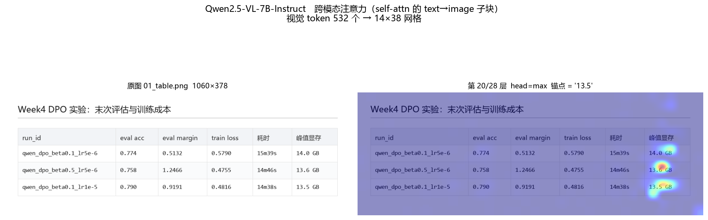
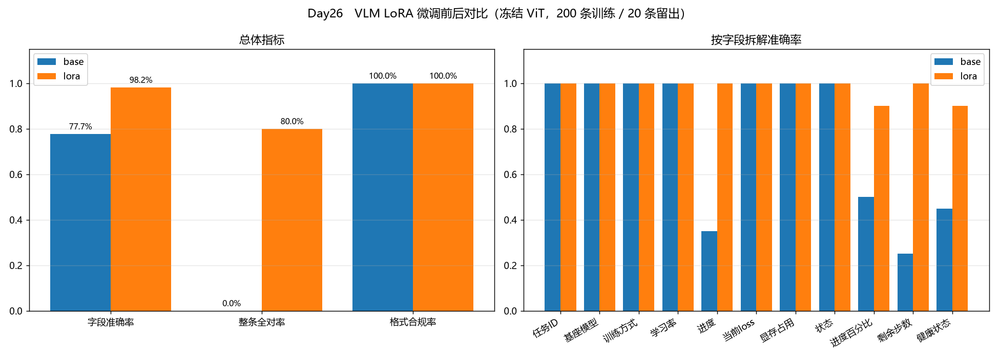

## 第 5 章 多模态与 Agent 实践

前四章的对象始终是一个纯文本模型：喂进去 token，吐出来 token。第 5 章要处理的是两次
**模态与能力边界的扩张**——第 5 周把图像接进这个模型的输入端，第 6 周把工具接进它的输出端。
两件事看起来无关，但它们暴露出的问题是同构的：**模型的"能力"不等于"可用性"，
中间隔着一层必须被显式设计的接口。**

### 5.1 视觉如何进入文本空间

#### 5.1.1 三步注入

视觉语言模型（VLM）并没有为图像新造一套解码器。它做的事只有一件：
把图像**翻译成 LLM 已经认识的那种向量**。

```
文本： "描述这张图" ──tokenizer──> [1234, ...] ──embed_tokens──> [n_text, d_model]
                                                                      ↘
                                                                  拼接注入 → LLM 解码器
                                                                      ↗
图像： H×W×3 ──patch+ViT──> [n_patch, d_vision] ──projector──> [n_img, d_model]
```

关键在最后那个 `projector`：它的输出与文本 embedding **活在同一个空间、同样的维度**，
占据 `<|image_pad|>`（Qwen）/ `<|image|>`（Gemma）这些占位符的位置。
进入解码器之后，LLM 分不清哪个向量原本是"字"、哪个原本是"图"。
这就是"图像被翻译进文本空间"的字面含义——也直接给出了第一条工程结论：
**一张图 = 几百到几千个 token**，这是显存与延迟的第一解释变量。

#### 5.1.2 参数拆解本身就是一条结论

**表 5-1　两个 7B/8B 级 VLM 的参数构成与视觉 token 策略**

| 模型 | 视觉塔 / 投影 / LLM | 视觉塔占比 | 视觉 token 策略 | 许可 |
|---|---|---|---|---|
| `Qwen2.5-VL-7B-Instruct` | 632.0M / 44.6M / 7615.6M | **7.6%** | **动态**：≈(H/28)×(W/28)，2×2 merge | Apache-2.0 |
| `gemma-4-E4B-it` | 169.3M / — / 7463.0M（+308.8M 其他） | **2.1%** | **固定预算**：70 / 140 / 280 / 560 / 1120 | Apache-2.0 |

视觉编码器只占总参数的 7.6% 与 2.1%。**VLM 的看图能力主要不来自视觉塔的容量，
而来自 projector 有没有把视觉特征对齐到 LLM 的 embedding 空间。**
这条拆解不是背景介绍——它是第 5 周敢于在微调时冻结整个 ViT 的直接依据（见 §5.3）。

选型上有一处对任务书的偏离需要说明：任务书按 8GB 显存写"务必选 2B 级 VLM"，
而本项目实际硬件是 24GB，前提不成立。更关键的是**实验有效性**：2B 级模型 OCR 幻觉率
本身就高，测出来的会是"小模型能力不足"而不是"幻觉行为"，结论没有分析价值。
因此上调到 7B/8B 级，并保持中美两个模型的同题对照。

### 5.2 跨模态注意力可视化

#### 5.2.1 一处方法论纠正：这两个模型里没有 Cross-Attention

任务书要求"提取 VLM 中间层的 Cross-Attention 权重"。核对 transformers 5.14.1 的源码后确认：
**Qwen2.5-VL 与 Gemma 4 都是 soft-token 注入 + 纯 self-attention 范式，模块树里
没有任何 `cross_attn` 层。** 真有 cross-attention 的是 Llama-3.2-Vision 那一系
（在 LLM 的第 3/8/13/18/23/28/33/38 层插专用 cross-attn 层，图像特征不进入文本序列）。

正确做法是取 self-attention 矩阵中 `text_token → image_token` 的**子块**：
`attn[0, head, text_pos, img_start:img_end]`。语义上等价于"跨模态注意力"，
但实现上寄生在 self-attention 里。**动手之前先确认模型属于哪种范式，
否则会花一整天去找一个不存在的模块。**

两个必踩的实现坑：

1. **必须 `attn_implementation="eager"`**。SDPA / FlashAttention 从不显式构造注意力矩阵——
   这正是它们快且省显存的原因，`output_attentions=True` 在它们下面返回 `None`。
2. **不要在 `generate()` 循环里抓**。带 KV cache 时每步注意力形状是 `[B, heads, 1, past+1]`，
   逐步拼接极易错位。正确做法是两段式：先正常 `generate` 拿答案（走 KV cache，快），
   再把 `prompt + 答案` 拼成完整序列做**一次 eager 前向**（teacher forcing）。

#### 5.2.2 量化证据：模型确实在"看图说话"



*图 5-1　Qwen2.5-VL-7B 生成数字 `13.5` 时第 20 层的跨模态注意力——热点精确落在「峰值显存」列*

**表 5-2　跨模态注意力的定量指标（第 20 层）**

| 模型 | 图片 | 视觉 token / 网格 | heads | **数字 token 的图像注意力占比** | 标点 token 占比 | 归一化熵 |
|---|---|---|---|---|---|---|
| `gemma-4-E4B-it` | `01_table.png` | 546 = 14×39 | 8 | **0.283** | 0.209 | 0.762 |
| `Qwen2.5-VL-7B` | `01_table.png` | 532 = 14×38 | 28 | **0.274** | 0.160 | 0.900 |
| `Qwen2.5-VL-7B` | `02_landscape.jpg` | 1247 = 29×43 | 28 | — | 0.153 | 0.889 |

**数字 token 的图像注意力占比显著高于标点 token（Qwen 上是 6~9 倍）。**
标点由语言模型先验决定，不需要看图；数字必须从图里读。这个差距就是"模型确实在看图"的
量化证据，而不是靠肉眼看热力图"觉得挺准"。

另外两条观察：**浅层看纹理、深层看语义**（第 5 层弥散全图，第 14 层起收敛到目标列）；
**结构化图像的注意力远比自然图像锐利**（表格图是几个锐利热点，风景图是"主体热点 + 大量
次级激活"）。后者的工程含义是：**VLM 在文档 / 表格 / UI 上比在开放场景描述上更可靠，
不是因为任务更简单，而是因为图像本身提供了明确的空间锚点。**

#### 5.2.3 可视化给出了一条完整的因果链

可视化在这里的价值不是"画了张好看的图"，而是**把三天的独立实验串成了一条因果链**：

**表 5-3　注意力形态如何解释 OCR 精度差异**

| | Qwen2.5-VL-7B | gemma-4-E4B-it |
|---|---|---|
| 视觉 token（同一张表格图） | 532 | 546 |
| 注意力头数 | 28 | **8** |
| 目标数字上的注意力 | 锐利，精确命中单元格 | 微弱、弥散地铺在整列 |
| 最强激活位置 | 目标单元格 | **表格右侧空白边缘**（attention sink） |
| 该图的 OCR 结果 | 全对 | 数字全对，形近字系统性错（`l`→`1`、末→本、憲→意） |

Gemma 把最强注意力倾倒在不含信息的边缘区域（attention sink），目标区域的注意力预算因此更少；
加上注意力头只有 Qwen 的 2/7，**空间分辨能力明显弱**。这与"数字对、形近字错"完全吻合：
粗粒度定位够用，细粒度字形辨识不够。

### 5.3 VLM 微调：评测集设计比训练配置更难

#### 5.3.1 第一版任务设计失败了

任务书给的微调例子是"根据图片写一段产品描述"。**产品描述是主观生成任务，
微调前后没法客观打分**，而验收要求"有明显效果提升"——主观任务只能人打分，
20 个样本说不清是提升还是噪声。

换成可客观打分的窄任务：**训练平台截图 → 团队规范的实验记录卡**，
20 条留出图 × 11 个字段 = 220 个字段逐个与真值精确比对。

第一版把 11 个字段全设计成"照抄"型（从截图里读出来即可），实测基线字段准确率就有约 92%，
微调最多再涨 8 个点，**测不出 LoRA 的价值**。第二版把字段分成两类：

**表 5-4　两类字段的设计意图**

| 类别 | 字段 | 基座能不能自己做对 |
|---|---|---|
| **照抄型**（8 个） | 任务 ID、基座模型、训练方式、学习率、进度、当前 loss、显存占用、状态 | 能，强基座 91.9% |
| **派生型**（3 个） | 进度百分比、剩余步数、健康状态 | **不能**——需要算术，且"健康状态"是一条只存在于训练数据里的团队规则 |

"健康状态"的规则是 `状态==失败` 或 `loss≥1.0` 或 `显存≥20.0 GB` → 需关注。
**这条规则没有写进 instruction**，基座只能猜，微调模型才能从 200 条数据里学到。
训练集与留出集用两条**独立随机流**生成（seed 42 / 10042），图片内容、版式、配色都不重叠。

#### 5.3.2 结果：提升全部落在基座做不到的地方



*图 5-2　VLM LoRA 微调前后的字段准确率对比*

**表 5-5　微调前后（20 条留出图 × 11 字段 = 220 个字段逐个比对）**

| 指标 | base | lora | 提升 |
|---|---|---|---|
| **字段准确率**（主指标） | 77.7% | **98.2%** | **+20.5%** |
| 　├ 照抄型 8 字段 | 91.9% | 100.0% | +8.1% |
| 　└ **派生型 3 字段** | **40.0%** | **93.3%** | **+53.3%** |
| **整条 11 字段全对率** | **0.0%** | **80.0%** | **+80.0%** |
| 格式合规率 | 100.0% | 100.0% | ±0 |
| 平均延迟 | 4.22 s | 6.97 s | +2.75 s |

四条读数：

1. **派生型 +53.3% 最能说明问题。**「健康状态」的判定规则不在指令里，基座只能猜
   （45%，接近二分类瞎猜）；微调后 90%——模型是真的从 200 条数据里学到了这条团队规范。
   **这就是 LoRA 在做的事：把领域约定编码进权重。**
2. **照抄型只 +8.1%，这是符合预期的。** 这些字段考的是读图精度，而 **ViT 被冻结了
   （可训练参数仅 0.4845%），视觉表征根本没变**。它反过来印证了 §5.1.2 的参数拆解结论——
   **LoRA 改的是语言侧怎么组织输出，不是眼睛怎么看。**
3. **格式合规率 100% → 100%，没有提升空间。**"微调让输出更规范"这种常见说法在强基座上
   已经不成立；200 条数据的价值只在于**教规则**，不在于教格式。
4. **延迟涨了 65%，但原因不是 LoRA 的计算开销**（40M 参数可忽略），而是微调模型
   **输出更完整**——base 经常漏字段或提前停。**评估延迟必须和输出长度一起看。**

### 5.4 从"会聊天"到"会用工具"：ReAct Agent

#### 5.4.1 三个工具，以及"求值"与"审查"的分野

第 6 周实现三个工具，其安全模型是**两种完全不同的形态**，这个区分值得单独说：

**表 5-6　三个工具的安全策略**

| 工具 | 行为 | 安全策略 | 为什么 |
|---|---|---|---|
| `calculator` | **求值** | **白名单 AST**：先 `ast.parse`，逐节点核对类型，只放行字面量 / 四则乘方比较 / 白名单数学函数 | 输入直接来自 LLM 的 Action Input，是不可信输入。黑名单永远漏（`().__class__.__bases__` 一类绕过），白名单让 `__import__`、属性访问、下标、lambda 在**求值之前**就被拦下 |
| `knowledge_search` | 检索 | 确定性混合打分（关键词 4.0 / 标题子串 2.0 / 字符 bigram 1.0 / 字段意图词 0.5） | 不上向量检索：6 商品 + 5 文档的规模上稠密检索没有优势，**反而让检索层变成黑盒**，错误归因时分不清是"模型选错工具"还是"工具召回错文档" |
| `code_check` | **审查，从不执行** | 黑名单（危险 import / `eval`·`exec`·`open` 调用 / `__class__`·`__globals__` 逃逸跳板）+ 结构统计 | 审查场景下黑名单是合适的：漏报只是少一条告警，**不会导致代码被执行，因为根本没有执行路径** |

第三个工具**故意取名 `code_check` 而不是任务书里的 `CodeExecutor`**：ReAct 中模型极大程度上
按名字的字面意思选工具，叫 executor 会诱导它拿来求运行结果，然后把"语法正确"误读成"运行结果"。
**45 次运行中没有任何一次模型试图用它求运行结果**——名字的字面语义确实主导工具选择。

工具层交付 **31/31 单测通过**（含 9 项安全攻击全部被拒）。这不是形式主义：
**把工具层钉死在"已验证"状态，是后续把任何异常都归因到模型侧的前提。**

#### 5.4.2 让 chat 模型"续写自己"

文本版 ReAct 要求模型**接着已有的 Thought/Action/Observation 往下写**，
但 Qwen 是 chat 模型——`apply_chat_template` 之后每个 assistant 轮都从空开始。

朴素做法是把 `agent_scratchpad` 塞进 user 轮。**实测这会直接导致死循环**：
3B 模型把它当成用户提供的资料，然后从头再输出一遍 Thought 1，永远走不到第二步。

正确做法是 **assistant 前缀填充（prefill）**：

```python
text = tok.apply_chat_template(messages, add_generation_prompt=True)
text += assist_prefill        # ← scratchpad 拼在生成起点之后
```

模型看到的是"一个说到一半的自己"，自然会续写下一个 Thought。
配套还必须能在 `Observation:` 处**精确停住**——否则模型会自己把 Observation 也编出来
（幻觉工具结果），Agent 退化成自问自答。这里用 `StoppingCriteria` 并**按解码后的字符串判停
而非 token id**：`Observation` 在不同上下文会被切成不同的 token 组合，按 id 匹配漏判率很高。

#### 5.4.3 工具调用 SFT：一条轨迹拆成 n+1 条样本

朴素做法是"一条完整轨迹 = 一条训练样本"，output 里含 Observation。
**这样训出来的模型会自己编造 Observation**——因为训练数据告诉它，写完 Action Input
之后就该接着写 Observation。

正确做法：一条 n 步轨迹拆成 n+1 条样本，第 k 条样本的 assistant 内容 =
「前 k−1 步（含各自 Observation，作为已知前缀）+ 第 k 步的 Thought / Action / Action Input」，
**到此为止，不含 Observation**。于是「Action Input 之后就是 EOS」这个模式被反复强化。

这个拆法同时与推理时的 prefill 机制**精确对齐**：训练时学的正是 `P(下一步 | 已有前缀)`
这组条件概率，训练与推理完全同分布。校验结果：146 条样本中 0 条违反截断规则。
配套地，`packing` 必须关——**打包会把下一条样本接在 EOS 位置，直接抹掉"写完就停"
这个核心训练信号**。

#### 5.4.4 五组端到端对照

9 道题 = 5 道单轮 + 4 道多步，严格判定口径：

**表 5-7　五组 policy 的端到端表现**

| 组 | 说明 | 严格命中 | 多步题 | 达成 ≥3 步 | 平均步数 | 失败模式 |
|---|---|---|---|---|---|---|
| `base` | Qwen2.5-3B-Instruct 原始基座 | 7/9 | 3/4 | 2/4 | 1.8 | 幻觉 2 |
| `sft` | 第 3 周最优 SFT | 7/9 | 2/4 | 1/4 | 1.4 | 心算 1、幻觉 2 |
| `dpo` | 第 4 周 DPO 交付模型 | **8/9** | 3/4 | 2/4 | 2.0 | 选错工具 1、心算 1、重复调用 1、幻觉 1 |
| `dpo_lora_v1` | + 工具 SFT（数据有 bug） | 7/9 ↓ | 3/4 | 3/4 | 2.4 | **死循环 1**、重复调用 1、幻觉 1 |
| **`dpo_lora`** | **+ 工具 SFT（修复后）** | **9/9** ✅ | **4/4** ✅ | 3/4 | 1.8 | **无** |

三条结论：

**① 事前假设被推翻，且如实保留。** 动手前的判断是"第 4 周的 DPO 模型是拿安全拒答对齐出来的
（β=0.5、约束紧、红线拒答率 100%），这份'对齐税'可能伤害工具调用能力"。
实测三方对照是 base 7/9、sft 7/9、**dpo 8/9**——DPO 组反而最好，且是唯一在微调前就稳定使用
calculator 做数值比较的组。可能的解释是第 4 周的偏好数据里包含"完整性"与"格式"两类偏好，
恰好与 ReAct 要求的"按格式完整走完流程"同向。

**② 工具调用 SFT 的收益是可归因到具体行为的**，不是一个笼统的分数提升：

| 题 | 微调前 | 微调后 |
|---|---|---|
| M2 | 2 步——**心算**比大小，违反 System Prompt 第 1 条 | 3 步——`1419 > 1000` 交给 calculator |
| M3 | 5 步——第 3、4 步完整重复第 1、2 步的查询 | 3 步——两次检索、一次求和，无冗余 |
| M4 | 把折后价当成含运费总价（**事实错误**） | 459 与 436.05 两个事实分别说对 |

**③ 一个会导致线上死循环的数据 bug，在 loss 曲线上完全不可见。** 见下节。

#### 5.4.5 死循环的根因：训练数据里 Action Input 与 Observation 不自洽

`dpo_lora_v1` 与修复后的 `dpo_lora` 训练指标几乎相同（train loss 0.0132 vs 0.0131，
eval loss 0.1964 vs 0.1935），但前者在某道题上连续 6 次发出相同调用直到撞上限。

根因：ReAct 的 `Action Input` 是**单行**的——模型无法在其中输出真换行，只能写转义的 `\n`。
构造训练数据时这一点处理对了，但 **Observation 却是用「真实换行的原始代码」算出来的**：

| | 训练数据（v1） | 线上真实 |
|---|---|---|
| Action Input | `def add(a, b):\n    return a + b`（字面 `\n`） | 同左 |
| Observation | `语法正确（共 2 行）` ← 用**真换行**算的 | `语法错误：…line continuation…` |

模型学到的因果是"发这个 Action Input → 得到『语法正确』"。线上却拿到语法错误，
与习得预期冲突；模型不认为是自己写错了，于是**原样重试**，必然得到同样错误 → 闭环。

> **一条可复用的原则**：训练数据里的 Observation，必须由「Action Input 里那个一模一样的
> 字符串」喂给**真实工具**产生，绝不能用另一份等价但不同形的输入去算。
> 任何"等价改写"（转义、去空格、格式化）都会在训练与推理之间制造分布裂缝，
> 而这种裂缝**在 loss 上不可见，只会在端到端行为上炸开**。

### 5.5 本章小结

第 5 周与第 6 周各自扩张了一次能力边界，但真正的收获在方法层面，且三条互相印证：

1. **接口比模型重要。** 图像要靠 projector 对齐进文本空间，工具要靠 prefill + 精确停机
   接进生成循环。两处的失败都不是"模型不够聪明"，而是接口没设计对。
2. **评测集设计比训练配置更难。** VLM 微调的第一版任务因为"基座本来就会"而测不出价值；
   Agent 的宽松判定口径会系统性低估错误率。**先问"基座本来就会吗"，
   只有基座不会的部分才能测出微调的价值。**
3. **训练指标健康 ≠ 线上行为正确。** 两个 loss 几乎一致的模型，一个 9/9、一个死循环。
   Agent 的质量只能靠端到端跑任务来衡量。

### 本章引用

[1] Bai J., et al. *Qwen2.5-VL Technical Report*. 2025.
[2] Yao S., et al. *ReAct: Synergizing Reasoning and Acting in Language Models*. ICLR 2023.
[3] Li Y., et al. *Evaluating Object Hallucination in Large Vision-Language Models (POPE)*. EMNLP 2023.
[4] Hu E., et al. *LoRA: Low-Rank Adaptation of Large Language Models*. ICLR 2022.
